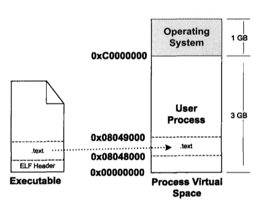
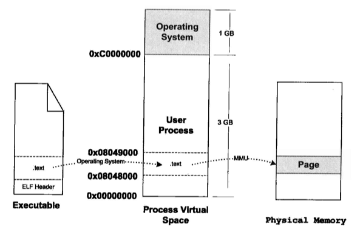
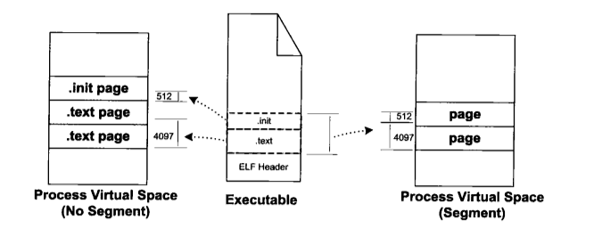

# ELF文件的装载

### 一. 程序的建立

* ##### 1. 创建一个独立的虚拟地址空间。

    虚拟地址空间的创建其实是采用类似`lazy binding`的方式实现，直接设置一个页目录即可，等到发生段错误的时候才进行映射处理。
    
* ##### 2. 读取可执行文件头，建立虚拟空间和可执行文件的映射关系。

    当应用程序执行发生一个段错误的时候，操作系统将从物理内存中分配一个物理页，然后将该"缺页"从磁盘读取到内存(物理内存)中， __然后设置虚拟页和物理页的映射关系(这里需要有一个数据结构来保存这些所需要的数据)__ ，之后操作系统将权限还给应用程序，程序从刚刚发生错误的地方重新执行。
    设置虚拟页和物理页的映射关系只是Linux内核中的一个数据结构，使用它可以找到 __虚拟内存区域(VMA,Virtual Memory Area)__ 。
    假设一个ELF中存在一个`.text`段，那么当这个ELF被装载后，进程中就会出现一个关于这个`.text`段的VMA。
    
    
* ##### 3. 将CPU的EIP(RIP)设置成可执行文件的入口地址，启动运行。
    ELF文件头中保存有入口地址，CPU就是通过这个地址进入程序执行的。
    
    
### 二. 页错误

假设一个程序的入口地址为`0x08048000`，是`.text`段的起始地址。当CPU执行这个指令的时候，发现`0x08048000~0x08049000`是一个空页面，段错误产生，CPU将控制器还给操作系统， __操作系统通过之前建立起的数据结构找到了空页所在的VMA__ ，并且计算出相应页面在ELF文件中的偏移，然后在物理内存中分配物理页面，之后将虚拟页和物理页建立映射关系，然后将控制器交给进程，从错误的地方重新运行。


### 三. 进程虚拟内存分布

如果一个段映射一个虚拟内存区域，那么容易产生内存浪费，如果存在2个段`.text`和`.init`段，大小分别是4097和512字节，如果一个页大小是4096，那么就将使用3个页面。


但是如果能将权限相同的段其合并映射到同一个虚拟内存区域，那么就能节省一些内存了。

__将这种"几个段合并到一起映射到一个虚拟内存区域"的东西，我们成为`Segment`， 而保存着中结构的称为程序头(Program Header)，ELF头部(.o对象文件不存在)还保存着这些程序头的东西，称为程序头表(Program Header Table)__ 。

这个程序表头一个数组，其中保存着一个结构体。

```C
typedef struct{
    Elf32_Word  p_type; // 类型
    Elf32_Off   p_offset; // Segment在文件中的偏移量
    Elf32_Addr  p_vaddr; // 虚拟地址起始地址
    Elf32_Addr  p_paddr; // 物理地址起始地址
    Elf32_Word  p_filesz; // Segment在ELF文件中所占空间长度
    Elf32_Word  p_memsz; // Segment在进程虚拟地址空间中所占长度
    Elf32_Word  p_flags; // Segment权限
    Elf32_Word  p_align; // Segment对齐
} Elf32_Phdr;
```

    


