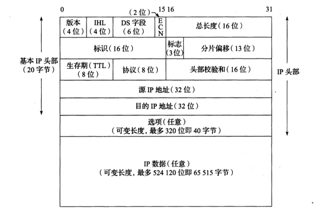
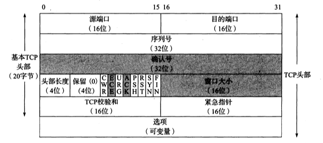
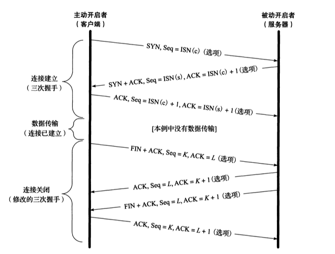
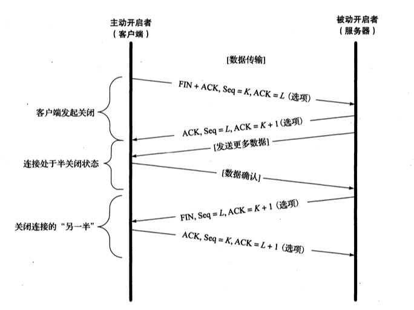

# TCP/IP协议exp

## 1. IP协议

__IP协议提供一种尽力而为的服务，它无法保证数据包一定会到对端，当发生某些错误时，IP数据包可能会被丢弃__ 。关于IP数据报的发送和接收方式，它总是从最高有效位开始发送 __(一个32位的值总是先将0-7bit发出，然后才是8-15bit....)__ 。如此的字节顺序称为 __网络字节序__ ，计算机所使用的字节序(大端与小端)有所不同，需要时需进行转换。

__0~3 bit__ `总共4bit`: __版本字段__ ，表示IP数据报的版本，一般为4和6，分别表示IPv4和IPv6。

__4~7 bit__ `总共4bit`: __IHL字段__ ，表示整个IP报头部字段的长度称为`IHL(Internet Header Length)`，由于只有4位，能表示最大值为15，其中每个`"1"对应一个32bit的大小`，也就是IP数据报头部被限制为最大值`15 * 32bit = 60bytes`。不过一般的IP数据包中都是`20bytes`，也就是将IHL设置为5。

__8~13 bit__ `总共6bit`: __DS字段__

__14~15 bit__ `总共2bit`: __ECN字段__

__16~31 bit__ `总共16bit`: __总长度字段__ ， __包括头部和数据部分__ ，我们可以配合IHL来判断`数据载荷`是从`IP数据报`的哪个地方开始的。由于它是一个16bit的字段，即能表示的最大值长度(包括头部)65535字节。即使如此，大多数的主机并不接受大于576字节的IPv4数据报(很多UDP协议都将自己的数据量限制为512字节大小，以免被抛弃)。要解决如此，需要将大的数据报分割成小的IP数据报发送(被分割的每个数据报本身还是相互独立)，其中片偏移字段就起到了作用。

__32~47 bit__ `总共16bit`: __标识字段__ ，留空。

__48~50 bit__ `总共3bit`: __标志字段__

__51~63 bit__ `总共13bit`: __分片偏移__

__64~71 bit__ `总共8bit`: __生存期字段__ TTL(time-to-live)表示的当前的IP数据报能经过的最大路由器数量，等同于IPv6中的最大跳，能够避免一些数据报在网络中出现循环跳的现象。一般将其设置为64或者128，少有的主机会将其设为255。当数据报被减少到0时，处理它的路由器会将数据报丢弃，并生成一个ICMP报告之发送着发生了什么。TTL影响到了整个头部字段的数据，每经过一个路由器都需要将头部效验和重新计算。

__72~79 bit__ `总共8bit`: __协议字段__ ，用于表明其IP数据报携带的上层协议是什么一般为17(UDP)和6(TCP)。

__80~95 bit__ `总共16bit`: __头部效验和字段__ ，此字段只效验IPv4头部是否发生了错误。IP数据报不保证其携带载荷的正确性，它由其上层协议自行验证。

__96~127 bit__ `总共32bit`: __源IP地址__ 。

__128~159 bit__  `总共32bit`: __目的IP地址__ 。

__160~最大479 bit__ 后续为可选字段，最多40字节。

## 2. TCP协议

TCP协议提供一种稳定的连接。

>### 2.1 TCP头部字段

下面直接分析其头部字段。

__0~15 bit__ `总共16bit`: __源端口__ 。

__16~31 bit__ `总共16bit`: __目的端口__ 。

__32~63 bit__ `总共32bit`: __序列号字段(seq)__ ，ISN(Initial Sequence Number)时通常是一个随机数，避免攻击，当数达到最大值时候回环从0开始。

__64~95 bit__ `总共32bit`: __确认号字段(ack)__ ，此字段配合ACK标志位，当ACK标志位设置为0时忽略，当ACK为1时启用。 __ACK表示一种“确认”，但我更愿称之为“请求”__ ，当对端发送一个`seq=x`的序列号时，本机回复`ack=x+1`，它表示 __“我已经成功接收到了你发送的数据”__ ，此外，还包含着 __“我希望你继续发送，发送的序列号请从x+1开始”__ 的请求。

__96~99 bit__ `总共4bit`: __头部长度__ ，同IP的IHL字段。

__100~103 bit__ `总共4bit`: __保留__ 。

__104~111 bit__ `总共8bit`: __这里将其总8个字段一起解释，每个字段占 1 bit__ 。
        
* CWR 即 __拥塞窗口减(Congestion Window Reduced)__ ，

* ECE 即 __ECN回显__ ，发送方收到了一个更早的拥塞通告。

* URG 即 __紧急(urge)__ ，启用紧急指针字段，很少使用。

* ACK 即 __确认(acknowledge)__ ，只要连接后，此字段一般都是置为1，即启用确认号字段。

* PSH 即 __推送(push)__ ，接收方尽快给应用程序发送这个数据(几乎没有用到)。

* RST 即 __重置连接(reset)__ ，连接取消，一般是对端发生了错误如主机宕机等。

* SYN 即 __同步(Synchronize Sequence Numbers)__ ，表示将初始化一个连接。此字段是受保护的(即seq需要包含此字段)，丢失时需要重传。

* FIN 即 __结束(finish)__ ，此报文发送方声明已经结束向对端发送数据。此字段是受保护的(即seq需要包含此字段)，丢失时需要重传。

__112~127 bit__ `总共16bit`: __窗口大小__ ，表明自身窗口大小，窗口大小将影响到一个TCP传输的效率和速率。

__128~143 bit__ `总共16bit`: __TCP效验和__ ，效验范围只包括头部字段。

__144~159 bit__ `总共16bit`: __紧急指针__ ，是一个加到seq上的一个正向偏移量，只有当URG置为1时启用，很少启用。

> ### 2.2 TCP连接

TCP的三次"握手"。

__主动发送SYN包的是主动打开一个连接__ ，一般为客户端。客户端发送一个`SYN`报文，其中`ISN`了一个`seq(客户端)`，表明为 __初始值__ ，而服务端则会回复一个新的`seq(服务端)`和一个`ack`，这个`ack=seq(客户端)+1`，表明已收到，客户端再次回复一个`ack=seq(服务端)+1`表明收到即建立连接。 __SYN报文是安全的，每发送一个SYN报文就会将seq+1，如果出现丢失情况，则SYN段会重传__ !

TCP的四次"挥手"。

当一端发送了一个`FIN`包表示本端不再写入数据了，对端(服务器)对其`ACK`回应后处于半关闭状态，当对端(服务器)也发送了`FIN`包后TCP断开连接， __主动断开端(客户端)需要在`TIME_WAIT`的状态下再等待`2MSL`时间__ 。这是由于如果最后一个`FIN`包如果丢失了，或者`ACK`包丢失了， __那么对端(服务器)不知道主动断开端(客户端)是否收到FIN包__ ， __所以主动关闭端(客户端)保留`2MSL`时间来处理`FIN`包或者`ACK`包丢失的情况__ 。
当一个`FIN`被收到，而主动关闭端(客户端)发送的`ACK`包丢失，那么服务器等待一段时间后将重传`FIN`包，客户端等待时间内能够及时重发`ACK`从而关闭连接。

__服务器应减少或者避免主动关闭连接，过多的`TIME_WAIT`占用端口在高并发情况下将是灾难性的__ 。
